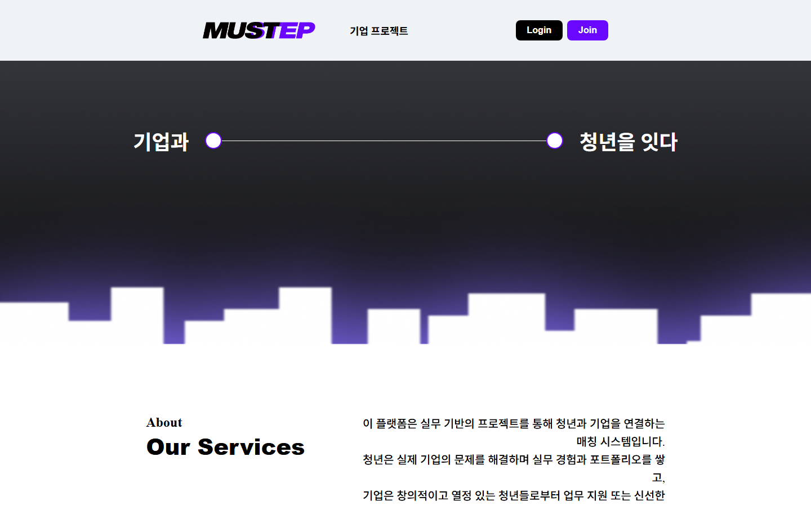
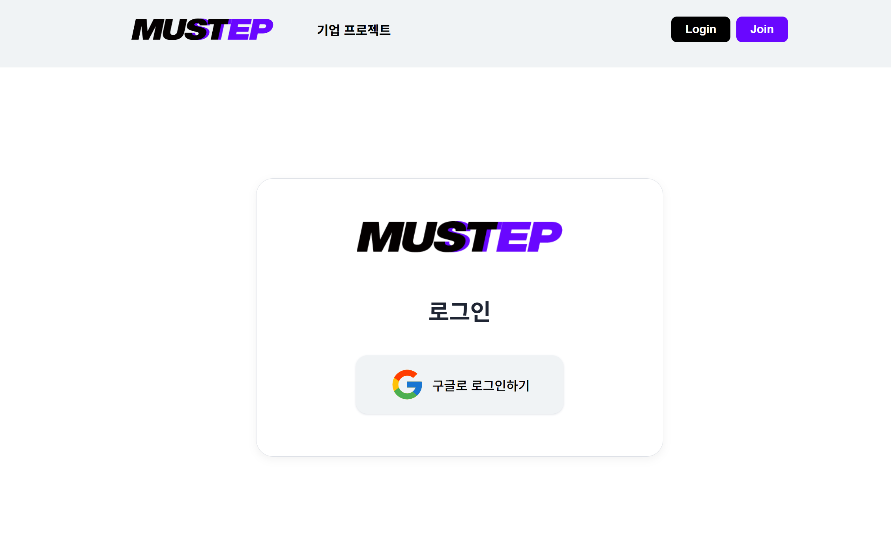
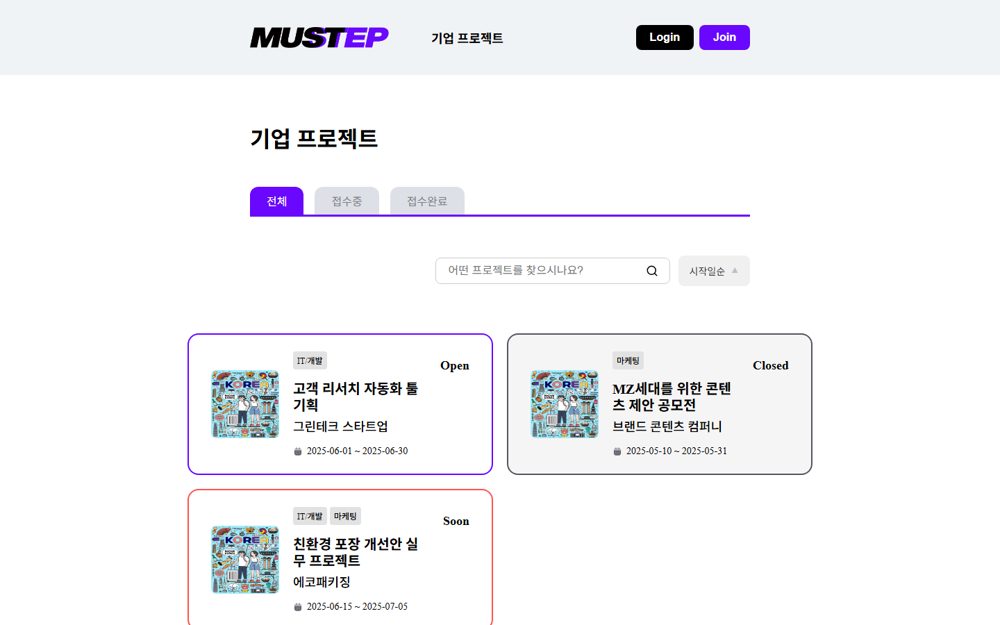
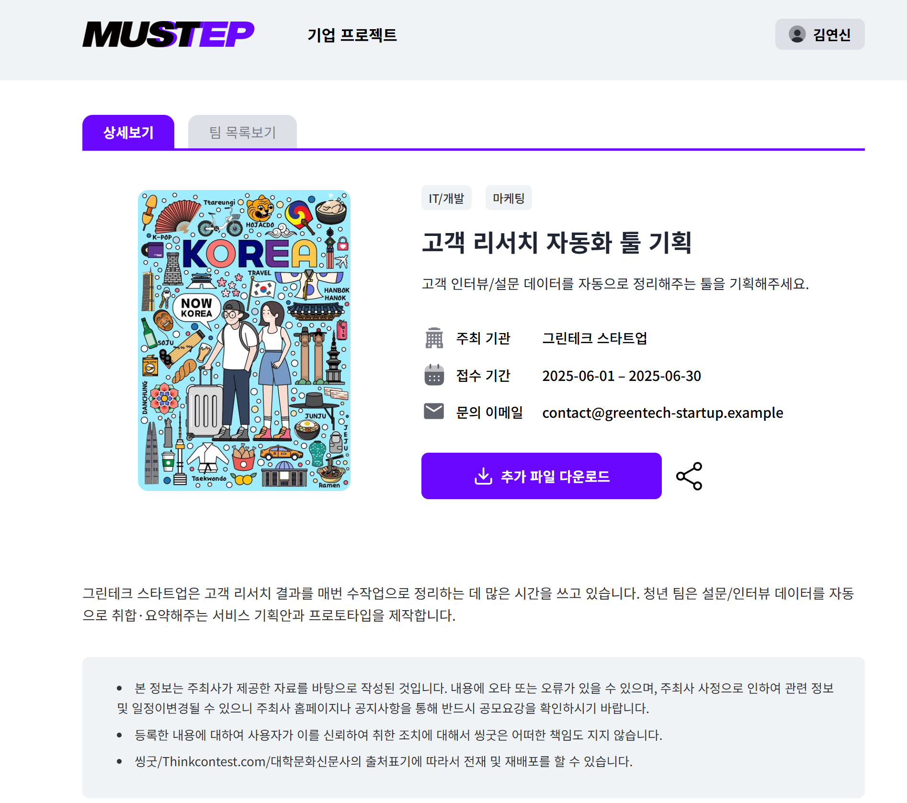
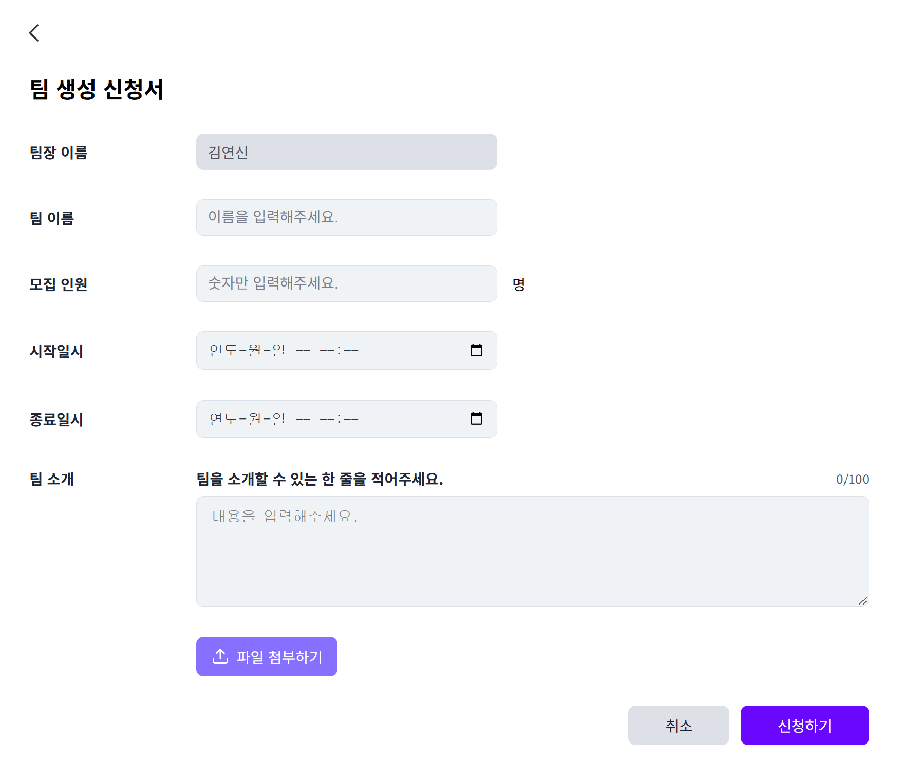
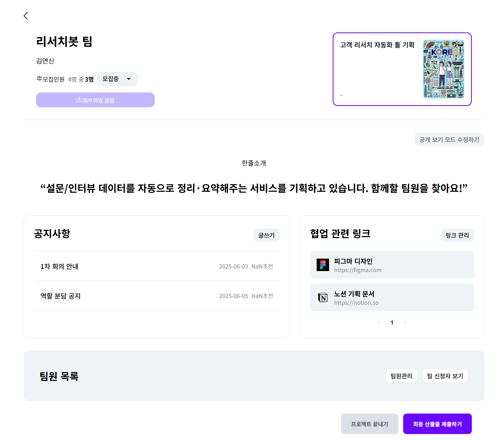
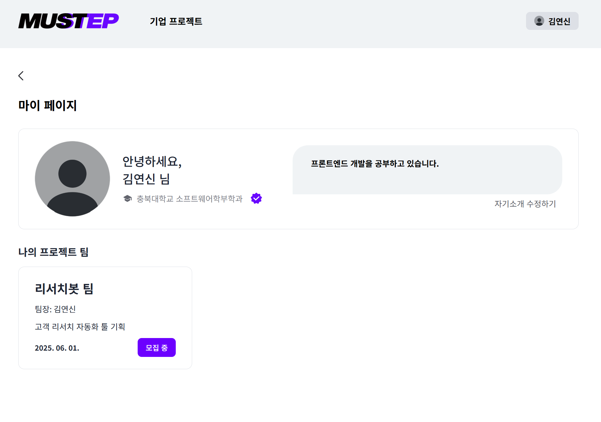

# 🎓 mustep 

## 청년과 기업을 실무 프로젝트로 연결하는 매칭 플랫폼 (Frontend)



<p align="center">
  <a href="docs/기획서.md">📋 기획서</a>
  &nbsp;·&nbsp;
  <a href="docs/구유프젝4팀_발표.pdf">📑 발표자료</a>
</p>

<br/>

## 🛎️ 서비스 소개

- mustep(Must + Step, "반드시 밟아야 하는 실무의 첫 걸음")은 기업이 올린 실무 과제에 청년들이 팀을 꾸려 참여하고, 결과물을 제출해 실무 경험과 포트폴리오를 쌓을 수 있는 매칭 플랫폼입니다.
- 대상 사용자: 실무 경험이 필요한 대학생·청년, 실무형 과제를 맡기고 싶은 기업

<br/>

## ❓ 배경 및 해결 목표

- 문제: 인턴은 경쟁이 치열하고 대외활동은 실무 경험으로 이어지기 어려우며, 기업도 신선한 아이디어와 실무형 인재를 만날 창구가 부족합니다.
- 목표: 기업의 실무 과제를 청년 팀이 직접 수행·제출하는 구조로, 청년에게는 실무 경험과 포트폴리오를, 기업에게는 아이디어와 인재 접점을 제공합니다.

<br/>

## ⭐ 주요 기능

> 아래 스크린샷은 실제 백엔드가 사라진 뒤, `demo/mock-data` 브랜치에서 MSW로 mock 데이터를 붙여 촬영한 화면입니다(실제 UI·코드 그대로 동작, 데이터만 가짜). 자세한 내용은 아래 "설치 및 실행"을 참고하세요.

### 1️⃣ 로그인 & 회원가입


- 구글 OAuth 연동 로그인/회원가입


### 2️⃣ 프로젝트(과제) 탐색 및 관리



- 기업 과제 리스트·상세 조회, 관리자 권한으로 신규 프로젝트 등록, 프로젝트 종료 처리


### 3️⃣ 팀 구성 및 참가 신청


- 신규 팀 생성, 팀 상세 조회, 참가 신청, 팀장의 승인/거절, 팀원 관리, 모집 상태 토글

### 4️⃣ 팀 내 협업 & 공지


- 팀별 공지사항 작성·수정·삭제, 협업 링크 공유


### 5️⃣ 마이페이지
- 프로필 조회·수정, 프로필 사진 변경, 자기소개 작성



<br/>

## 🔧 기술 스택

> **Frontend**


> **Backend** (팀원 담당)


<br/>

## 🚀 설치 및 실행

> ⚠️ 연동하던 백엔드 서버가 더 이상 존재하지 않아, `main` 브랜치를 그대로 실행하면 로그인 이후 데이터가 필요한 화면은 API 요청이 실패합니다. **실제로 화면이 동작하는 걸 보려면 `demo/mock-data` 브랜치를 사용하세요** — MSW로 주요 API를 mock 처리해 백엔드 없이도 목록/상세/팀/마이페이지 화면을 그대로 확인할 수 있습니다.

<details>
<summary><b>demo/mock-data 브랜치로 mock 데이터 실행하기</b></summary>

```bash
git clone https://github.com/9oormthonUNIV-CBNU/2025_9oormthonUNIV_4_FE.git
cd 2025_9oormthonUNIV_4_FE/mustep-fe
git checkout demo/mock-data
npm install
npm run dev:mock
```

👉 http://localhost:3000 — 프로젝트 목록/상세, 팀 상세(공지·협업 링크), 마이페이지까지 mock 데이터로 정상 동작합니다. 로그인이 필요한 화면은 브라우저 콘솔에서 `localStorage.setItem('token', 'mock-token')` 실행 후 새로고침하면 접근할 수 있습니다(실제 서비스에선 구글 OAuth 로그인으로 발급).

</details>

아래는 `main` 브랜치를 그대로 실행하는 방법입니다(코드 구조 확인용, 데이터 연동은 되지 않음).

### 1. 저장소 clone

```bash
git clone https://github.com/9oormthonUNIV-CBNU/2025_9oormthonUNIV_4_FE.git
cd 2025_9oormthonUNIV_4_FE/mustep-fe
```

### 2. 환경변수 설정

`mustep-fe/.env.example`을 복사해 `mustep-fe/.env`를 만들고 값을 채웁니다.

```bash
cp .env.example .env
```

<details>
  <summary><b>[mustep-fe/.env.example]</b></summary>

| 변수 | 필수 | 설명 |
| ---- | :--: | ---- |
| `VITE_GOOGLE_OAUTH_REDIRECT` | ✅ | 구글 OAuth 로그인 후 리다이렉트할 URL |
| `VITE_SERVER_END_POINT` | ✅ | 백엔드 API 서버 주소 |

`VITE_SERVER_END_POINT`는 실제로 동작하는 백엔드 서버 주소가 아니면 API 요청이 모두 실패합니다(위 "설치 및 실행" 상단 안내 참고).

</details>

### 3. 의존성 설치r

```bash
npm install
```

### 4. 실행

```bash
npm run dev
```

### 5. 접속

👉 http://localhost:3000 (로그인 화면까지만 정상 확인 가능, 이후 데이터 연동 화면은 위 안내 참고)

<br/>

## 👥 팀원 소개

> **Frontend**

| <a href="https://github.com/YeonShin"></a> | <a href="https://github.com/iconoclast7"></a> |
| :---: | :---: |
| **김연신**<br/>[@YeonShin](https://github.com/YeonShin) | **김진우**<br/>[@iconoclast7](https://github.com/iconoclast7) |

> **Backend**

| <a href="https://github.com/NamMinwu"></a> | <a href="https://github.com/newrhyme"></a> | <a href="https://github.com/JH031"></a> |
| :---: | :---: | :---: |
| **남민우**<br/>[@NamMinwu](https://github.com/NamMinwu) | **김상현**<br/>[@newrhyme](https://github.com/newrhyme) | **박주현**<br/>[@JH031](https://github.com/JH031) |

> **기획 · 디자인**

|  |  |
| :---: | :---: |
| **서시왕**<br/>기획 · PM | **이희경**<br/>디자인 |
